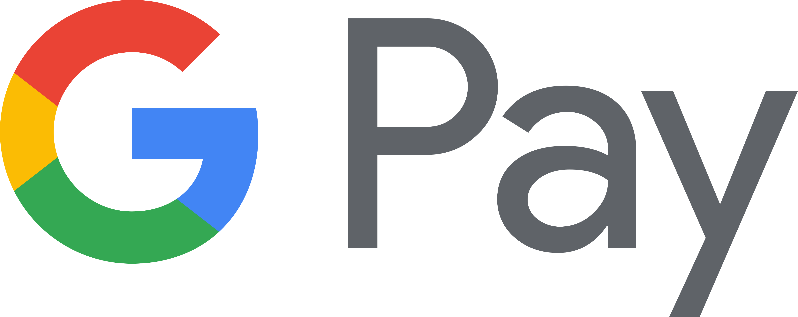

# Fund Your MetaMask

## Fund your MetaMask wallet with **$AVAX**


MetaMask uses the Avalanche C-Chain Mainnet - some CEXs only have X-Chain support and your $AVAX have to be converted first!


**Method 1:** Buy **$AVAX** on PangolinDEX with a credit card 💳 **** 

**Method 2:** Buy **$AVAX** on a centralized Exchange which supports the **C-Chain** and withdraw directly to your MetaMask wallet address 


CEXs with C-Chain support: KuCoin, GateIO, OKEx, BitMart, BitFinex


**Method 3**: Buy **$AVAX** on a centralized Exchange 

Send your **$AVAX** to the **X-Chain** address of your [https://wallet.avax.network/](https://wallet.avax.network/) wallet - cross-swap from **X &gt; C-Chain** and withdraw to your MetaMask wallet address

List of CEXs to buy **$AVAX**



