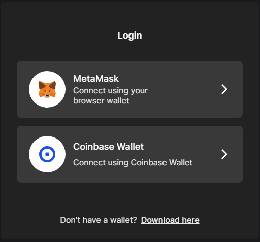

# 🆎 The Avalanche Bridge

The Avalanche Bridge (AB) can be used to transfer ERC20 tokens from Ethereum to Avalanche's C-Chain and vice versa.



## Transferring Ethereum ERC20 Tokens to Avalanche

1. Access the [https://bridge.avax.network/](https://bridge.avax.network)
2. Select "**MetaMask**" or "**Coinbase Wallet**" and log in to your wallet

3\. Ensure that the UI says "**From Ethereum**" as shown below. If it does not, press the "**Switch**" button and click "**Switch Network**" when **MetaMask **prompts you to

4\. Select the token you would like to bridge and enter the amount you would like to bridge

5\. Select "**Transfer**"

6\. Wait for the **Ethereum** and for the **Avalanche **transaction to **confirm**

7\. After your tokens are successfully bridged, you can review the transaction details

**Congratulations**! You bridged your **ERC20 **tokens to **Avalanche**. These tokens can now be used to swap for another token or add liquidity to a pool on **Pangolin**.

### Useful Links







