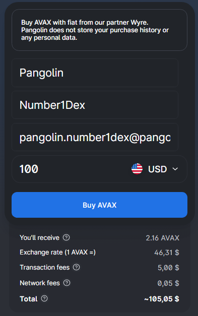
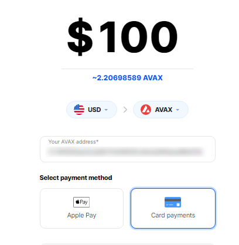
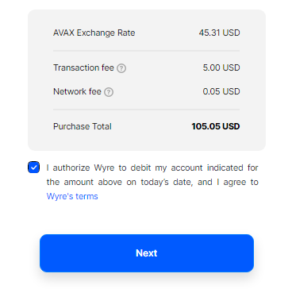
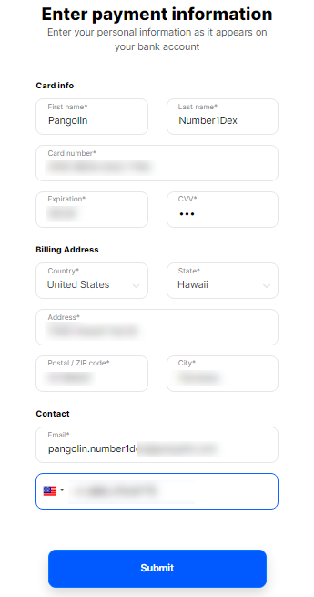

# 💳 Buy with Credit Card

## Buy $AVAX with Credit Card or Apple Pay™

  

1\. Fill in your contact details, select a currency and enter an amount

2\. Check the transaction breakdown and select "**Buy AVAX**"

3\. Select "**Card Payments**"

4\. Agree to the Terms and click "**Next**"

5\. Enter Payment Information and click "**Submit"**


Apple Pay™ will only work with Apple devices and on the Safari browser

