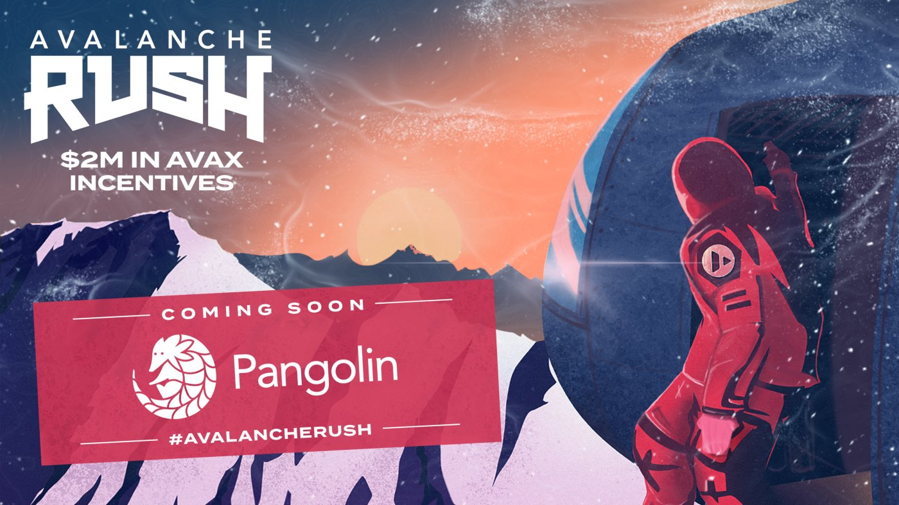
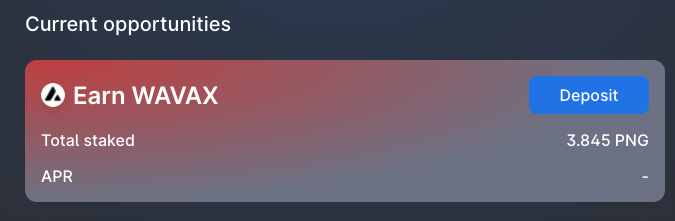
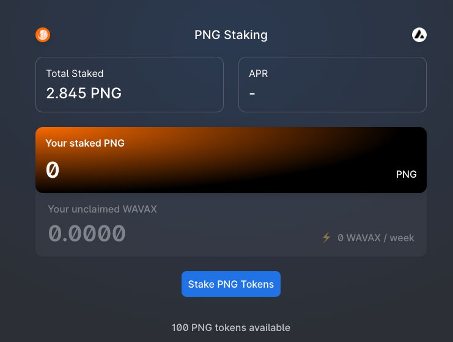
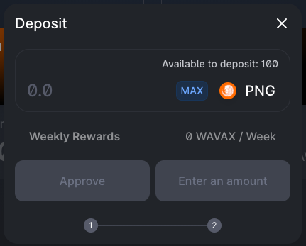
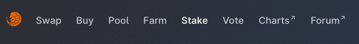
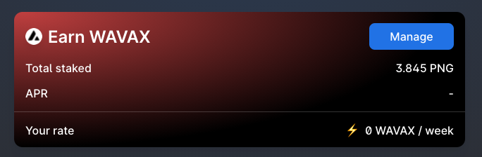
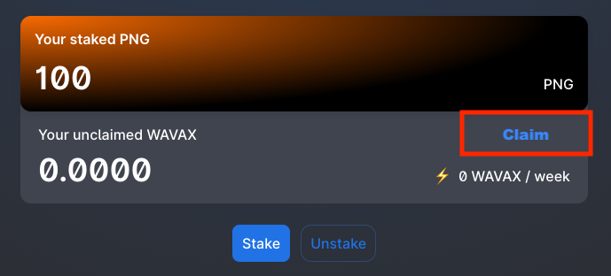
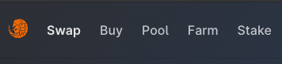
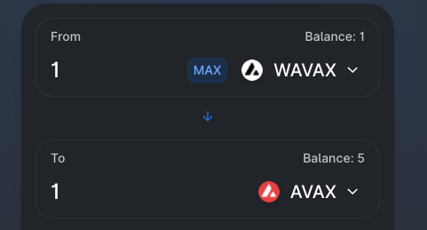
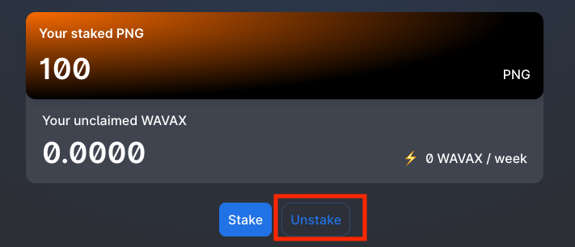

# 🥩 PNG Staking

## Stake PNG tokens to earn WAVAX (Wrapped AVAX)

Users can stake $**PNG **tokens to earn $**WAVAX **(Wrapped $AVAX). This is part of the **Avalanche Rush** incentives program.

Deposits start: 16:00 UTC Wednesday September 8th, 2021

Rewards start: 04:00 UTC Thursday September 9th, 2021

Total incentives: **$2M AVAX**

Duration: **3 months**

### Depositing PNG Tokens

1\. Select "**Stake**"

2\. Find the Earn **WAVAX **card

3\. Select "**Deposit**"

4\. Select "**Stake PNG Tokens**"

5\. Enter the amount of **PNG **tokens you would like to stake

6\. Select "**Approve**" and **sign **the transaction

7\. Select "**Deposit**" and **confirm **the transaction

### Claiming Rewards

After depositing your **PNG **tokens, you will accrue **WAVAX **tokens. You can claim your earned **WAVAX **tokens without having to remove your **PNG **tokens

1\. Select "**Stake**"

2\. Select "**Manage**" on the Earn **WAVAX **card

3\. Select "**Claim**"

4\. Select "**Claim**" again and **confirm **the transaction through MetaMask

**Congratulations**! You have just received your **WAVAX **rewards

### Convert WAVAX to AVAX

**WAVAX **is the wrapped version of **AVAX**. If you want to un-wrap your **WAVAX **to **AVAX**, you can do this on the swap page for a 1:1 conversion

1\. Select "**Swap**"

2\. Select **WAVAX **as the first token and **AVAX **as the second token

3\. **Approve **and **Swap**

**Congratulations**! You have just received your **WAVAX **rewards

### Unstaking PNG Tokens

1\. Select "**Stake**"

2\. Select "**Manage**" on the Earn **WAVAX **card

3\. Select "**Unstake**"

4\. **Confirm **the transaction in MetaMask

**Congratulations**! You have successfully unstaked your **PNG **tokens
