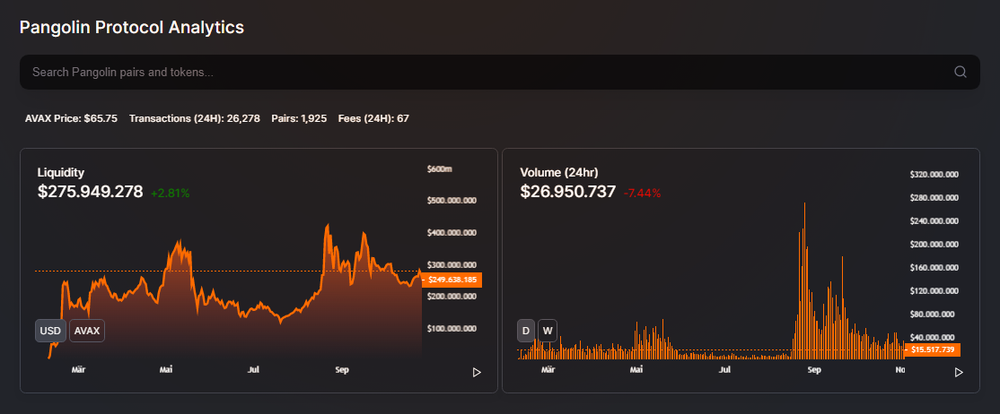
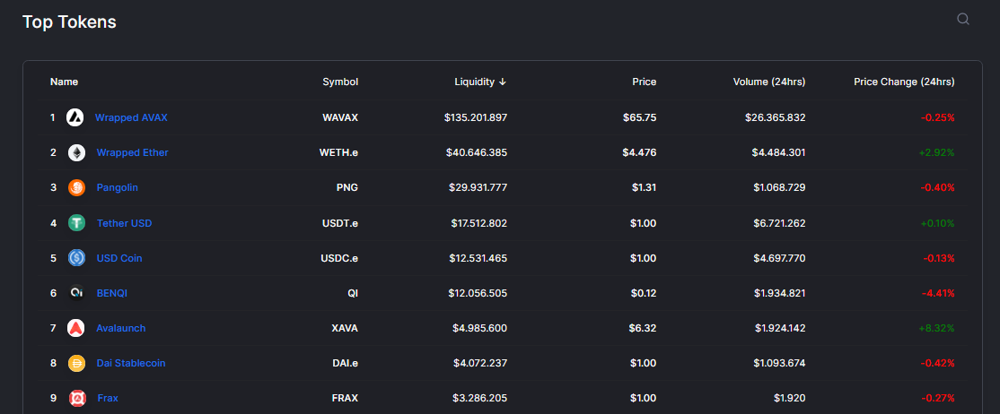
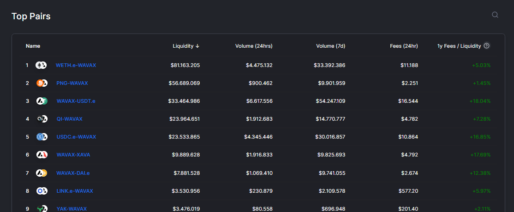
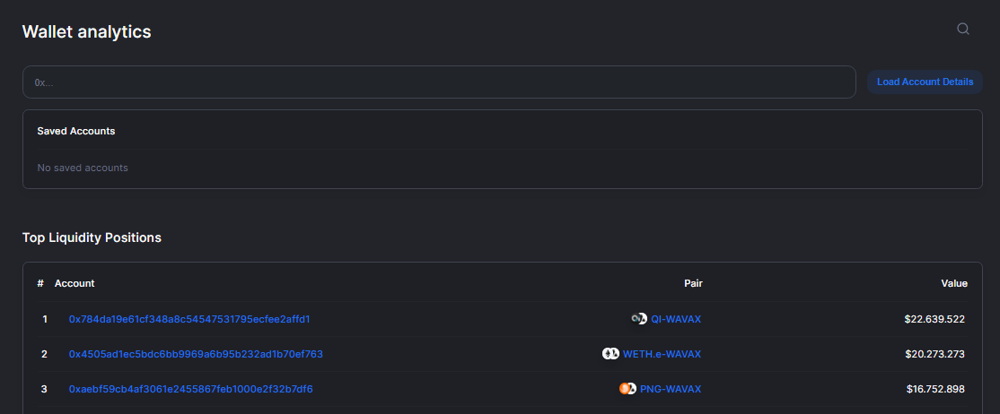

# 📈 Analytics

### Overview

Search tokens and pairs on Pangolin, check statistics like daily Transactions and Fees, listed pairs and historical charts for Liquidity and Volume, Top-Tokens, Top-Pairs and a detailed Transactions list.

### Top Tokens

A list of the Top 200 tokens on Pangolin

### Top Pairs

A list of the top 100 pairs on Pangolin

### Accounts

Wallet Analytics - view and track any wallet address, lookup positions, earned fees, liquidity, transactions, other wallet stats and the Top 100 Liquidity positions.


