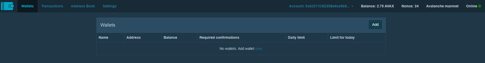

# Multisig

## Create a new Multisig

First log onto Pangolin's [Multisig site](https://multisig.pangolin.exchange/#/wallets). Please make sure you've connected your Metamask

Then click "Add"

Enter the name of your wallet and how many signatories are required and then add the owners

Congratulations your DAO has a new multisig, further protecting your DAO

## Restore an existing Multisig

Click "Add"

Let's add Pangolin's multisig

You'll now be able to see the Pangolin multisig and interact with it

## Adding a multisig transaction

First navigate into the multisig you'd like to interact with

Click the Add button next to the Multisig transactions

**Please note:** If you look at the above, you'll see the ABI string is there. This ABI can be gotten from the C Chain explorer. So if you look here [https://cchain.explorer.avax.network/address/0x912b5D41656048Ef681eFa9D32488a3fFE397994/contracts](https://cchain.explorer.avax.network/address/0x912b5D41656048Ef681eFa9D32488a3fFE397994/contracts) You'll be able to copy the ABI and paste it in the transaction menu and you'll then get access to all the methods.

